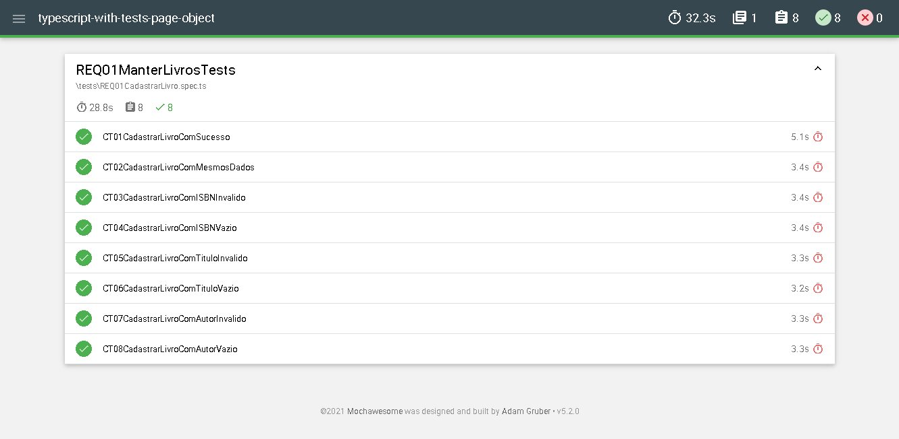

# **ED12 - Estudo de Caso - Teste de Sistema**
Testes automatizados na plataforma [Sistema de Controle de Empréstimo](https://ts-scel.herokuapp.com/) com uso do Page Object.

 

## ✅ Resultado Obtido

  

## 👨🏼‍💻 **Tecnologias**

- Typescript
- Mocha
- Chai
- Selenium IDE
- Mochawesome
- Rimraf

## 📕 **Referencias**

- [Document Mocha](https://mochajs.org/)
- [Document Chai](https://www.chaijs.com/)
- [Rimraf](https://www.npmjs.com/package/rimraf)
- [Selenium WebDriver](https://www.npmjs.com/package/selenium-webdriver)
- [Selenium IDE](https://chrome.google.com/webstore/detail/selenium-ide/mooikfkahbdckldjjndioackbalphokd)